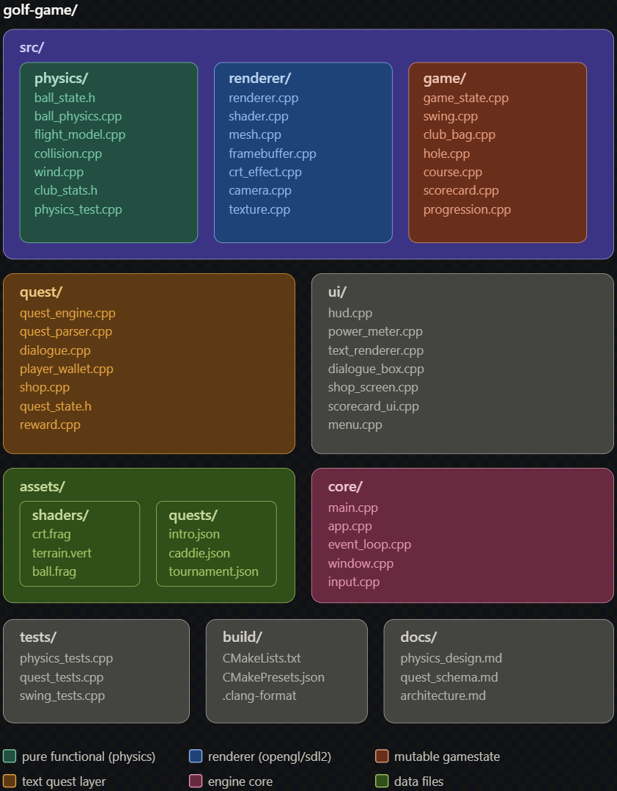
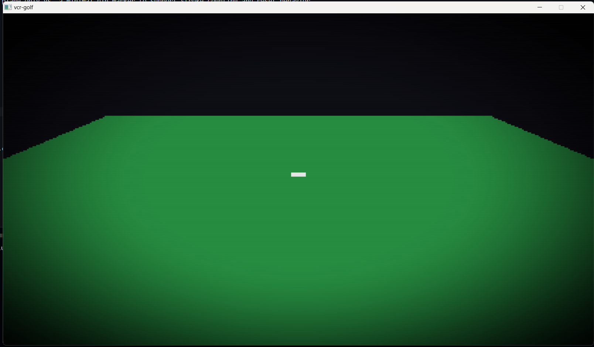
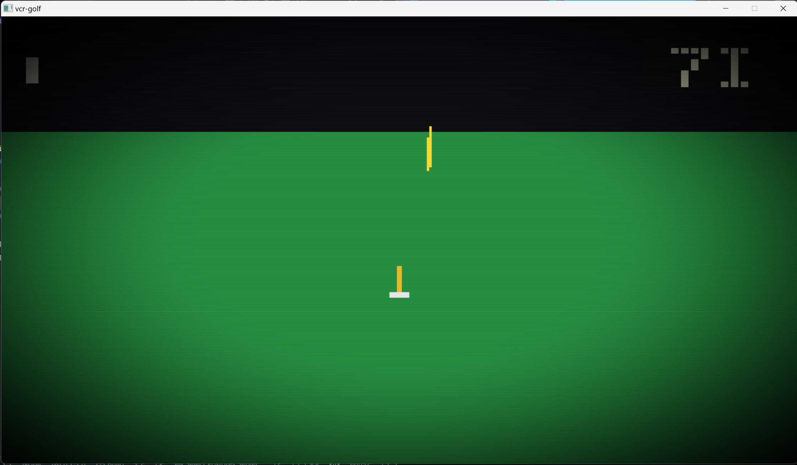
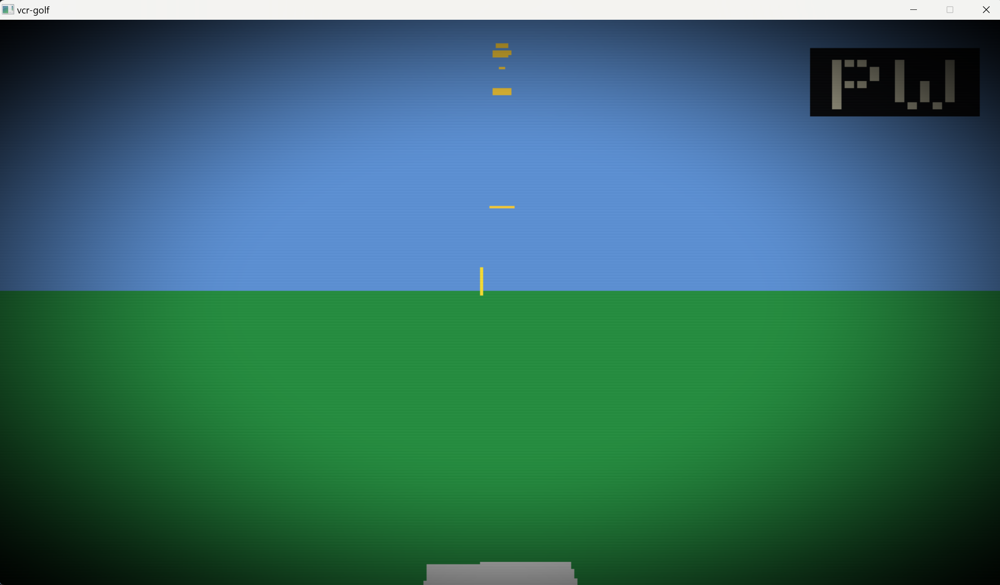
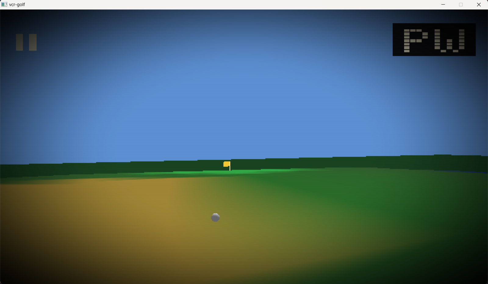
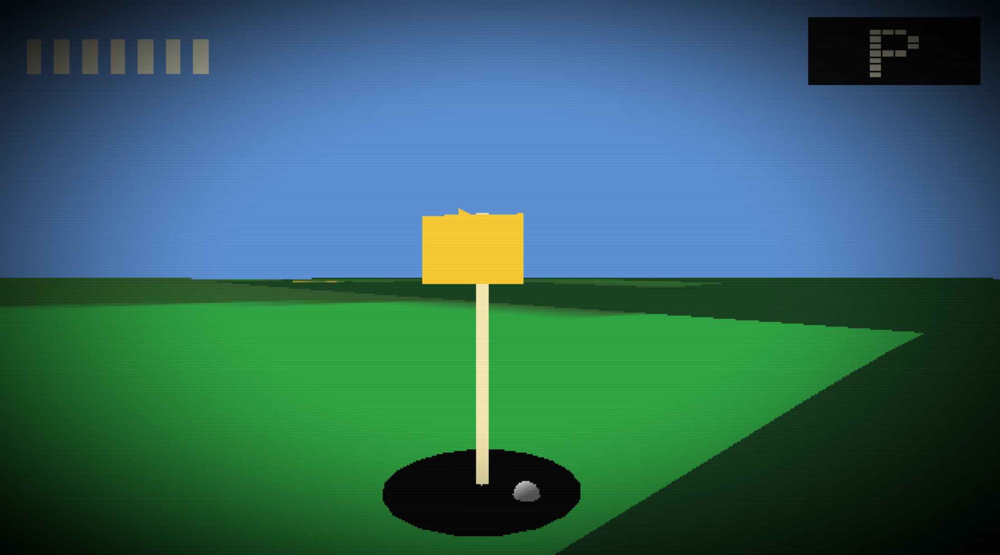
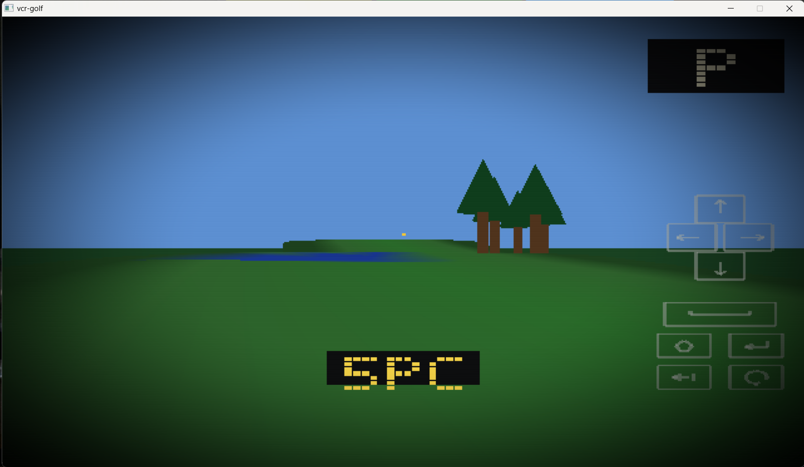

# golf++

A pixelated, VCR-aesthetic 3D golf game with text-driven RPG progression. Built almost entirely with AI assistance (Claude + GPT) when tooling was available.

**Timeline snapshots (00→06):**

<table>
  <tr>
    <td></td>
    <td></td>
    <td></td>
    <td></td>
  </tr>
  <tr>
    <td></td>
    <td></td>
    <td></td>
    <td></td>
  </tr>
</table>

---

## Quick start (debug)

```bash
cmake --preset debug
cmake --build build/debug
./build/debug/golf++
```

## Release build (Windows helper)

```pwrshl
.\gb      # configure + clean rebuild release
.\gb -r   # build release, then launch golf++
.\gb -rr  # build release, stop running copy from this build, relaunch
```

## Dependencies

CMake 3.25+, SDL2, SDL_mixer, OpenGL, and GLM. GLAD + doctest are vendored.

See `AGENTS.md` for the detailed architecture rules and AI editing context.
