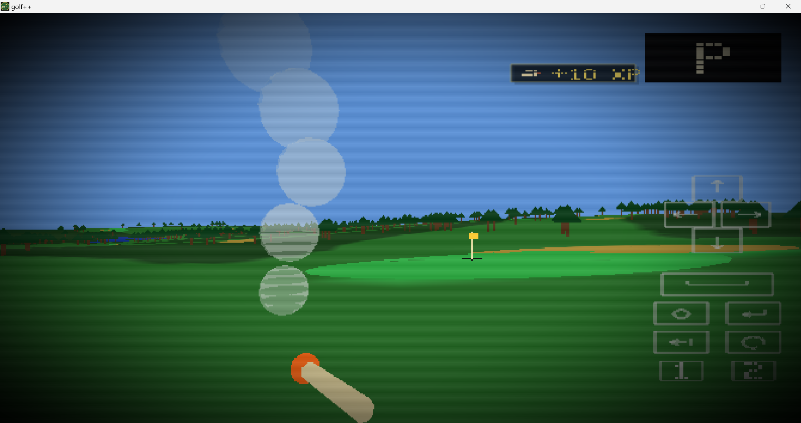

# golf++

A lo-fi 3D golf game in C++ that looks like it was taped on a 1989 camcorder.
Play real-world courses imported from OpenStreetMap, walk or drive between
holes, and level up skills like golfing, fitness, drifting and smoking.



## Build

Needs CMake 3.25+, Ninja, SDL2, SDL2_mixer, OpenGL and GLM.

```bash
cmake --preset release && cmake --build build/release && ./build/release/golf++
cmake --preset test && cmake --build build/test && ./build/test/golf++-tests
```

On Windows, `.\tooling\gb -r` builds the release preset and launches it.

`golf++-tests <text>` runs only the tests whose name contains `<text>`.
