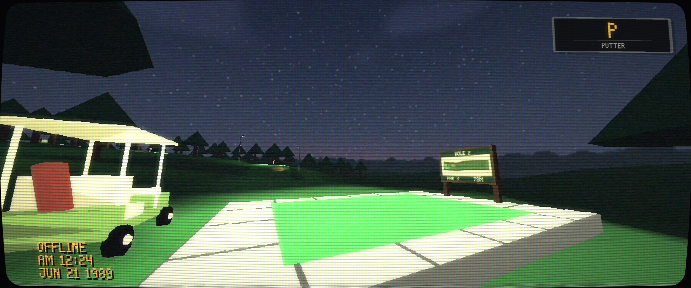

# golf++

A lo-fi 3D golf game in C++ that looks like it was taped on a 1989 camcorder.
Play real-world courses imported from OpenStreetMap, walk or drive between
holes, and level up skills like golfing, fitness, cart driving and smoking.

Play online with up to 40 players on a course, in groups of up to 4 sharing a
scorecard, or offline on your own. Offline never needs a server or an account.



golf++ is in alpha, heading for a commercial release. The source is public to
read, not to use: all rights are reserved ([LICENSE](LICENSE)). The course
data is OpenStreetMap's, under the ODbL.

## Build

Needs CMake 3.25+, Ninja, SDL2, SDL2_mixer, OpenGL and GLM, and Rust for
online play (the build compiles its client bridge with cargo; with MinGW, add
the `x86_64-pc-windows-gnu` target). `-DGOLFPP_NET=OFF` builds without it,
offline only.

```bash
cmake --preset release && cmake --build build/release && ./build/release/golf++
cmake --preset test && cmake --build build/test && ./build/test/golf++-tests
```

On Windows, `.\tooling\gb -r` builds the release preset and launches it, and
`.\tooling\gb -m` starts a local server and two clients on it for testing
online play ([tooling/README.md](tooling/README.md)). The server itself builds
with the SpacetimeDB CLI and the Emscripten SDK ([server/README.md](server/README.md)).
`.\tooling\release\build_release.ps1` builds the Windows installer players
download and the server package owners run their own server from
([tooling/README.md](tooling/README.md), [server/hosting.md](server/hosting.md)).

`golf++-tests <text>` runs only the tests whose name contains `<text>`.
